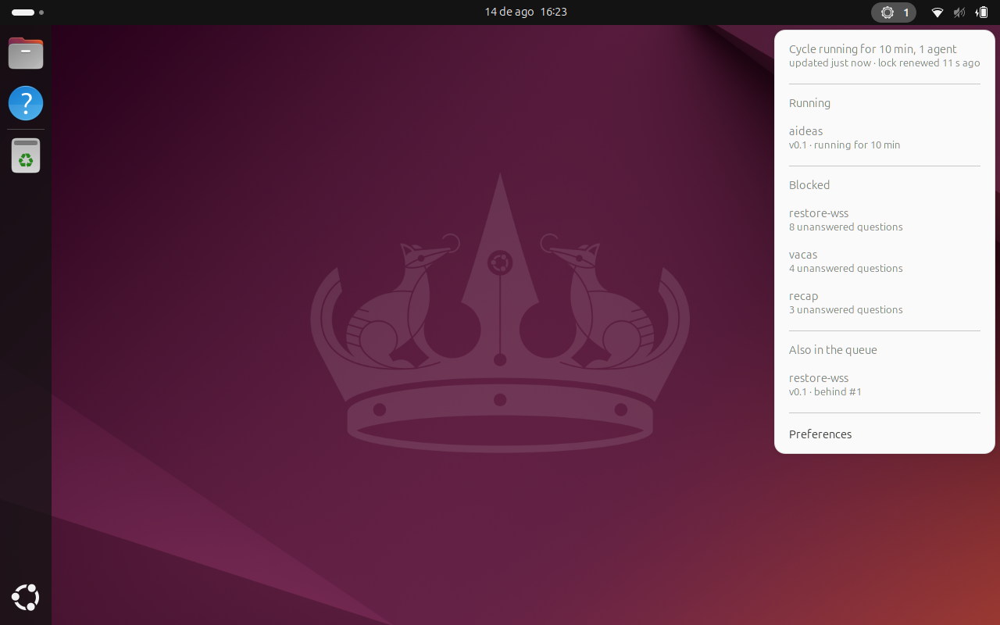
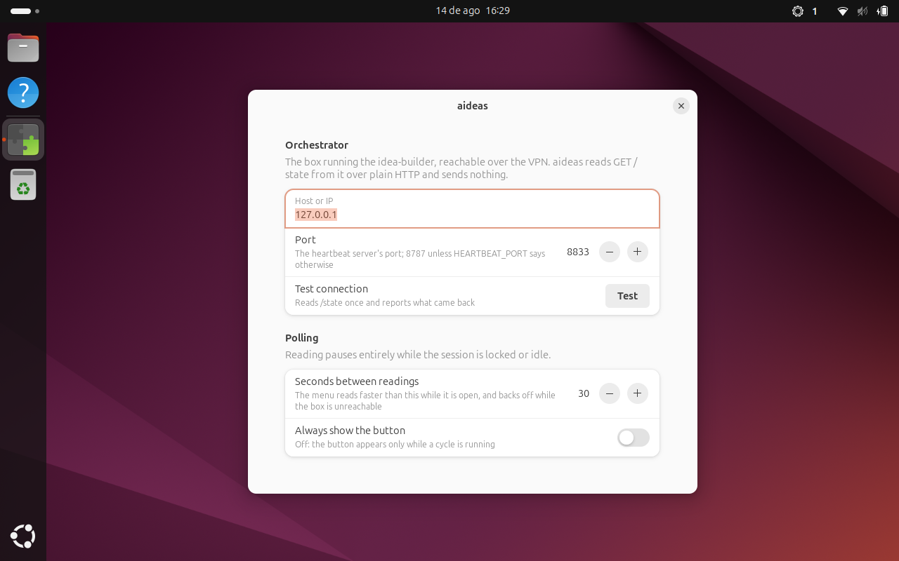

# aideas — the orchestrator's state in the GNOME top bar

[](https://sonarcloud.io/summary/new_code?id=gortazar_aideas)

*aideas has no repository of its own, so the badge covers the whole `gortazar/aideas`
repository — this extension, gnome-tasks and the orchestrator — not this directory alone.*

A panel indicator that shows what the idea-builder orchestrator is doing. A button appears
while a cycle is running; its menu lists which ideas are **running**, which are **ready** to be
built next, and which are **blocked** waiting for you to answer a question.

```sh
curl -fsSL https://raw.githubusercontent.com/gortazar/aideas/main/ideas/aideas/install.sh | sh
```

Then set the box's address — or export `ORCHESTRATOR_HEARTBEAT_URL` before installing, as the
laptop already does for the heartbeat hook, and the installer fills it in for you:

```sh
gnome-extensions prefs aideas-shell@patxi.gortazar
```



That screenshot is the extension reading the orchestrator that was building it at the time:
`aideas` running for 10 minutes, three ideas blocked on unanswered questions, and a second
`restore-wss` entry queued behind the first.



## What it shows, and what it decides

Nothing. **The orchestrator classifies every idea; the extension renders what it is told.** It
reads `GET http://<box>:8787/state` — the endpoint `orchestrator/heartbeat_server.py` already
serves — and each row's words come from the `state` and `note` it returns.
[`docs/state-contract.md`](docs/state-contract.md) specifies that response, and
`tests/test_state_contract.py` asserts it against fixture repositories, so the two halves
cannot drift apart while they live in one repo.

| The menu | Where it comes from |
| --- | --- |
| `Cycle running for 12 min, 2 agents` / `Idle` | `running`, `agents`, `cycle_started_at` |
| `updated 8 s ago · lock renewed 42 s ago` | when the reading was taken, and `lock_age_seconds` |
| **Running** — slug, version, how long the cycle has run | rows with `state: running` |
| **Blocked** — slug, `2 unanswered questions`, then the questions themselves | rows with `state: blocked`, and their `open_question_texts` |
| **Ready** — slug, `minor update -> v0.3`, with the next one marked | rows with `state: ready` |
| **Also in the queue** — `behind #1`, `no PLAN.md yet` | `queued`, `to be planned`, anything new |

Under each blocked idea, the menu lists **what it is actually waiting to be told** — up to
three of its unanswered questions, wrapped over two lines, with `+2 more` when there are others.
The orchestrator folds each question out of `PLAN.md` and bounds it; the extension wraps it.

Rows are read-only: answering a blocked idea means editing its `PLAN.md` on the box, which is
not something a panel menu should do.

## The two things the menu does

Beneath the queue, above *Preferences*:

**Check now** reads `/state` immediately. Worth having in three situations: the box was down and
the poller has backed off to five minutes (a click resets that), you have just answered a
question and want to watch the idea go `ready`, or you have just started a cycle. The menu stays
open, because the header's own `updated just now` is the answer to the click.

**Run a cycle** asks the box to start one, and this is the only thing aideas ever writes. One
click, no confirmation. A cycle refuses far more often than it starts, so the item reports which
gate said no, in the orchestrator's own words:

| It says | Because |
| --- | --- |
| `Paused: .orchestrator/stop exists` | the stop file is there |
| `Outside allowed_hours (23:00-08:00 Europe/Madrid)` | not the time of day it was told to build |
| `Daily budget spent ($12.40 of $10)` | `max_daily_cost_usd` is reached |
| `A Claude Code session is active on this laptop` | the heartbeat gate: you are working |
| `A cycle is already running` | the lock is held |
| `claude is not on the orchestrator's PATH` | it would have started and failed every agent |
| `this box does not support starting cycles` | the box predates 0.4 |

`started` from the box means **launched**, not finished — the cycle re-checks its own gates and
can still exit — so the extension keeps watching `/state` for 45 seconds and says
`The cycle exited without starting — check the journal on the box` if it never appears.

**Run anyway** appears only after a refusal about *when* it is convenient to build — the schedule
or the laptop heartbeat — and skips exactly those two. It never skips the stop file, the daily
budget or the lock: a pause, a spent cap and a running cycle are not things to click past.

The item goes insensitive, with the reason beneath it, whenever clicking could not possibly
work. A box answering `available: false` is *reachable*, so the item stays live there — it can be
told to try, and the answer will be honest either way.

Starting a cycle needs the box's `HEARTBEAT_SHARED_SECRET` if it has one; set it in
preferences. Reading the queue needs no secret. The secret lives in GSettings, which anything in
your session can read — it is the same secret the heartbeat hook already holds in its
environment, so it adds no new class of exposure, but it is not a vault.

## The bulb

The button is a light bulb, and it is **grey because it is symbolic** — a shipped
`-symbolic.svg` painted with `currentColor`, which GNOME recolours to the panel foreground.
So it matches the top bar in light themes and dark, and dims with it. Which also means the
state cannot be carried by colour, and is carried by the drawing instead:

| The bulb | What it means |
| --- | --- |
| lit, with rays | a cycle is running; the badge counts the agents |
| a bulb with a question inside | an idea is waiting on an answer, but the queue can still move |
| a plain bulb | idle: nothing running, nothing waiting |
| a bulb struck through | **every** idea is blocked — nothing moves until you answer something; the badge counts them |

The three states that are about the *connection* rather than the queue keep their stock glyphs,
where a network-offline or warning sign says more than a bulb could.

The button is visible **while a cycle is running**, and also **whenever every idea is
blocked** — the one state whose whole meaning is that a person is now the only thing that can
move the queue. Turn on *always show the button* if you would rather see it the rest of the
time too. If contact is lost while a cycle
was running, the button stays for five minutes wearing an "unreachable" icon, with the last
good reading dated beneath it — one dropped poll on a VPN should not blink the panel out.

## Behaviour worth knowing

- **It spawns nothing, and writes one thing.** GJS and libsoup only, which is what the GNOME
  Extensions review guidelines require and why `/state` exists at all. The single write is
  `POST /cycle`, which asks the box to start a cycle and is the whole of "Run a cycle".
- **Polling pauses completely** while the session is locked (GNOME disables the extension) or
  idle (Mutter's idle monitor). A laptop asleep on a desk does not wake up to talk to a VPN
  host. Every 30 s otherwise, configurable 10–300 s, 5 s while the menu is open, backing off to
  five minutes while the box is unreachable.
- **"Cannot reach the orchestrator" is an ordinary state**, rendered calmly — and kept distinct
  from "the box answered and cannot read its queue", because those mean opposite things.
- **No secret is stored.** `GET /state` is unauthenticated and protected by the server binding
  to a VPN address, which is what the rest of the system already assumes.

## Diagnosing a setup

```sh
gjs -m tools/probe-state.js <host> [port]
```

Reads `/state` with the extension's own transport, client and wording, and prints what *Test
connection* would say, what the panel would look like, and the whole menu. If this disagrees
with the panel, one of them is wrong.

```
[ok] Connected to 127.0.0.1:8833
        cycle running, 1 agent · 5 ideas queued · 3 ideas blocked
```

## Working on it

The source lives here rather than in an upstream repository of its own: the README entry says
to build it in this repo, so this folder carries what an upstream normally would — the flake,
the tests, the installer and the release workflow.

```sh
nix develop           # gjs, glib, gtk4, libadwaita, eslint, python3, dbus
make help             # every target
make check            # lint + unit + http + contract + bundle — what CI runs
nix flake check       # the same four checks in the sandbox
```

| Test | What it covers | Needs |
| --- | --- | --- |
| `make test-unit` | 297 tests: parsing, grouping, wording, actions, visibility, badge, icons, backoff, scheduler | gjs, gdk-pixbuf |
| `make test-http` | 39 tests: the real libsoup transport and the cycle POST, against a stub server | gjs, python3 |
| `make test-contract` | 79 tests: `/state`, the cycle preflight and `POST /cycle`, over fixture repositories | stock python3 |
| `make check-bundle` | the assembled extension loads: metadata, imports, compiled schema | gjs, glib |
| `make smoke` | 78 checks in a nested headless GNOME Shell, plus screenshots | a GNOME machine |
| `make test-install` | 39 checks: `install.sh` run for real, from a clean directory | dbus, zip |
| `make test-pack` | the artefact is a function of the source alone, and `nix build` agrees | zip, nix |
| `make test-release` | 19 checks: the release decision, over fixture releases lists | python3 |

`make smoke` and `make test-install` both isolate `XDG_CONFIG_HOME` and run on a private
session bus. That is not decoration: dconf writes are performed by a service that reads *its
own* environment, so without it a test session rewrites the real desktop's settings.

```
src/lib/          pure, Shell-free, tested headlessly — state, menu, scheduler, transport
src/extension/    what runs inside gnome-shell: indicator, prefs, idle watcher, icons/
ci/               the smoke test, its probe extension, and the pack, installer
                  and release-decision tests
docs/             the /state contract
tools/            probe-state.js, check-bundle.js, check-release.sh
```

## Releases

The release is a tag on this repository, `aideas-shell-v<version>`, published by
[`.github/workflows/release-aideas.yml`](../../.github/workflows/release-aideas.yml). The
workflow creates its own tag, because a tag made in a worktree would never survive the
orchestrator's plain `git push`.

**What triggers one.** A push to `main` that changes something *shipped* — `src/`, `Makefile`,
`flake.nix`, `flake.lock`, `tools/check-bundle.js` or the release machinery itself. Editing
`STATUS.md`, `PLAN.md`, `docs/`, `screenshots/` or the tests does not. `install.sh` is
deliberately outside that list: it is fetched raw from `main`, so a change to it is live at
once and needs no release.

**What it does before publishing.** Asserts one version across `STATUS.md`, `metadata.json` and
`flake.nix`; runs `nix flake check` and the `/state` contract test; builds the artefact with
`nix build` — the same derivation the checks just validated, so a tool missing from the runner
cannot break the release the way it did for v0.1; then asks
[`ci/release-plan.sh`](ci/release-plan.sh) whether to publish at all. It publishes only when
`STATUS.md` says `status: done`, and never publishes bytes identical to the newest release —
the artefact is reproducible (fixed epoch, sorted entries, fixed modes, `TZ=UTC`), so
"unchanged" is a fact about content rather than about timestamps.

**What a release contains.** The packed extension, `<asset>.sha256`, and `SHA256SUMS` — both
checksum layouts, because `install.sh` asks for the first and the rest of this repo publishes
the second.

**Tags.** `aideas-shell-v0.2` for the first artefact at a version, then `aideas-shell-v0.2-2`,
`-3` for later ones, so every published artefact keeps its own immutable tag and `install.sh`'s
"newest first" rule still finds the latest.

**Publishing by hand, and checking afterwards.** Run the workflow from the Actions tab
(*Run workflow*, optionally ticking *force* to publish something not marked done). Afterwards:

```sh
make check-release      # tools/check-release.sh
```

which asks GitHub whether the newest release exists, downloads it, and checks its digest,
its checksums and the version inside the artefact against this tree. That is how "the release
is really there" gets confirmed — an agent cannot push this repo, so nobody sees the run that
publishes.
