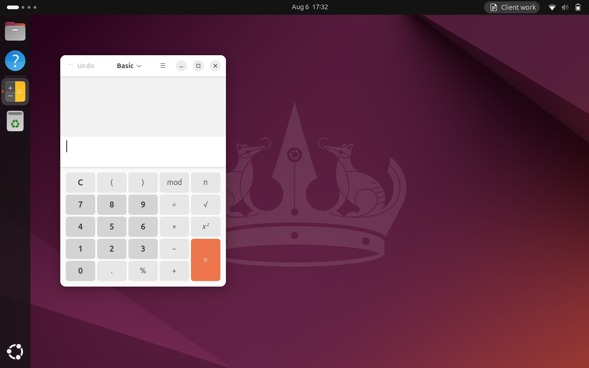

# gnome-tasks — KDE Activities for GNOME

KDE's Activities let you group applications, documents and background commands under a named
task, then switch between tasks so the desktop comes back the way you left it. GNOME has
workspaces, which are ephemeral, unnamed and restore nothing. `gnome-tasks` builds the missing
layer on top of GNOME Shell.

It is three cooperating pieces, for reasons explained in [PLAN.md](PLAN.md) and
[docs/gnome-internals.md](docs/gnome-internals.md):

| Piece | Lives in | Job |
| --- | --- | --- |
| `gnome-tasks-daemon` | its own process, owns `org.gnome.Tasks` | all state, all persistence, all subprocess work |
| the Shell extension | inside `gnome-shell` | the top-bar switcher, and the window introspection/placement only in-process code can do |
| app adapters | per app | recovering "which document is this window showing", by capability tier |

Anything slow or risky stays out of the compositor: the extension only makes D-Bus calls.

## Status

The core loop works: **a task remembers the applications you opened, and switching back to it brings
them back where they were.** Verified end to end in a real (nested, headless) GNOME Shell 46 session
by `tools/smoke-nested.py`. Documents, per-task commands, the preferences window and the browser
adapters are not built yet — see [STATUS.md](STATUS.md) for exactly what works today and
[docs/limitations.md](docs/limitations.md) for what cannot work at all.



The top bar shows the current task ("Client work"); the window was launched and placed by
gnome-tasks when that task was activated. The screenshot is taken inside the nested test session
described under [Tests](#tests) — the switcher's popup menu cannot be captured there, because a
panel menu needs a pointer grab that a headless session has no seat to provide.

```console
$ gdbus call --session --dest org.gnome.Tasks --object-path /org/gnome/Tasks \
      --method org.gnome.Tasks.CreateTask "Client work" "folder-documents-symbolic"
('6f8b2c1e-0a4d-4f1b-9c3a-1d2e3f4a5b6c',)
$ gdbus call --session --dest org.gnome.Tasks.Shell --object-path /org/gnome/Tasks/Shell \
      --method org.gnome.Tasks.Shell.ListWindows
('{"windows":[{"id":"518573128","appId":"org.gnome.Calculator.desktop","identified":true,…}]}',)
```

## Requirements

GNOME Shell 46 on Wayland (the version on the development machine; X11 is explicitly out of
scope — see the answered open questions in [PLAN.md](PLAN.md)).

## Development environment

Everything is pinned by the flake — `gjs`, `glib`, `gtk4`, `libadwaita`, `gnome-shell` (for
`gnome-extensions pack`), `eslint` and `dbus`:

```console
$ nix develop          # or `nix develop --command make check`
$ make help
```

## Tests

Tests-first is the rule in this repo, so the test command matters more than the build one.

```console
$ make test-unit       # Shell-free logic under plain gjs: task model, schema migration,
                       # persistence, window interpretation rules
$ make test-dbus       # the daemon's D-Bus surface, on a private bus via dbus-run-session
$ make test            # both
$ make lint            # eslint over src/, tests/, tools/
$ make check-bundle    # assemble the extension and validate metadata + imports
$ make check           # all of the above, which is what CI runs
```

`nix flake check` runs the same checks hermetically:

```console
$ git add -A && nix flake check
```

The `git add` is not optional: a flake only ever sees git-tracked files, so a brand-new,
untracked test file is invisible to `nix flake check` and will appear to pass.

Window capture and restore cannot be tested this way — it needs a compositor. For that there is a
nested headless Shell, which is also how the extension itself is exercised without disturbing the
running desktop:

```console
$ make build
$ tools/nested-shell.sh start --extension build/gnome-tasks@patxi.gortazar --state /tmp/gtn
$ source /tmp/gtn/env
$ gjs -m src/daemon/main.js &          # the daemon, on the nested session's private bus
$ gdbus call --session --dest org.gnome.Tasks.Shell --object-path /org/gnome/Tasks/Shell \
      --method org.gnome.Tasks.Shell.Ping hello
$ tools/nested-shell.sh stop --state /tmp/gtn
```

See [docs/testing.md](docs/testing.md) for what is covered where, and what is verified by hand.

## Build and install

There is no published release; this is a self-installed extension plus daemon (publishing to
extensions.gnome.org is explicitly not a goal, which is what makes the daemon design possible).

```console
$ make install         # extension into ~/.local/share/gnome-shell/extensions,
                       # daemon into ~/.local/lib/gnome-tasks + a user unit
```

Then log out and back in — under Wayland the Shell cannot be reloaded in place — and enable it:

```console
$ make enable
$ make logs            # follow both the Shell and the daemon
```

`make uninstall` removes all of it.

## Packaging

```console
$ make pack            # build/gnome-tasks@patxi.gortazar.shell-extension.zip
```

The zip is installable with `gnome-extensions install --force <zip>`, but on its own it is not
enough: the daemon has to be installed too (`make install-daemon`).

## Layout

```
src/lib/          Shell-free modules, shared by daemon + extension + tests
                  (protocol, task model, persistence, window interpretation)
src/daemon/       gnome-tasks-daemon: state, persistence, restore orchestration
src/extension/    the Shell extension: top-bar UI, window introspection and placement
tools/            probe extension and other research scripts (see docs/gnome-internals.md)
tests/unit/       plain-gjs unit tests
tests/dbus/       integration tests against a private session bus
docs/             the research this design rests on, written from experiment
```
