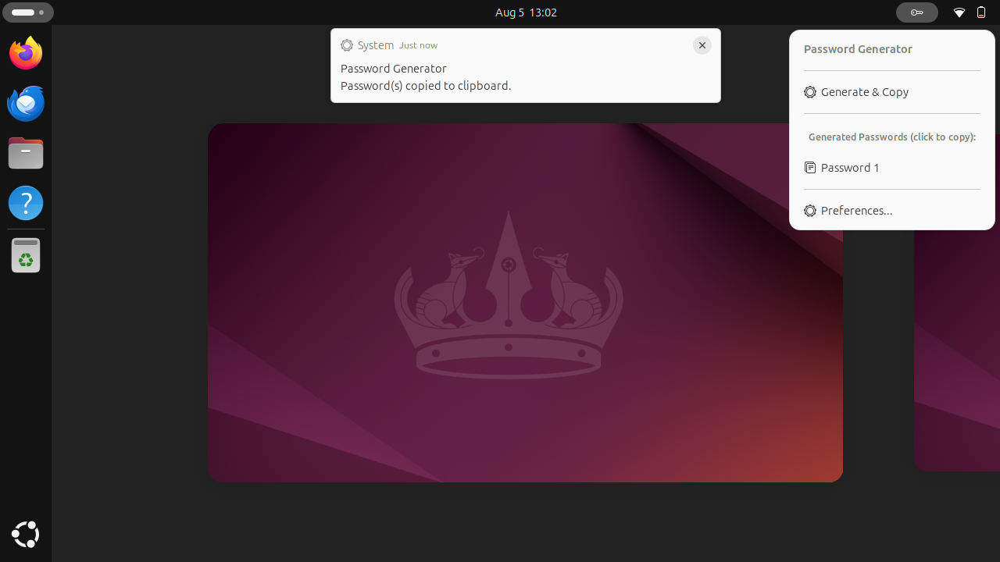
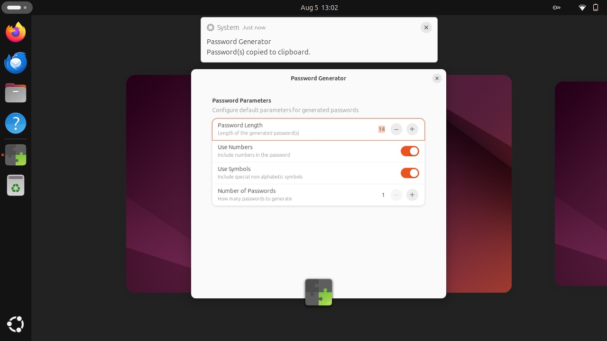

# pwgen — passwords generated inside the extension

[`pwgen`](https://github.com/gortazar/gnome-shell-pwgen) is a GNOME Shell extension that
generates a password and copies it to the clipboard. It used to shell out to the external
`pwgen(1)` binary. It no longer does: passwords are generated in-process, in JavaScript,
from the system entropy pool.

That matters for two reasons. Spawning an external program is a rejection risk at
[extensions.gnome.org](https://gjs.guide/extensions/review-guidelines/review-guidelines.html)
whenever an alternative exists, and `pwgen` is not part of any GNOME dependency chain — on a
system without it the extension could only tell the user to install a package. The extension
now has no runtime dependency beyond GNOME Shell itself.

| | |
| --- | --- |
| Menu, after generating |  |
| Preferences |  |

Both images are captures of the real extension running in a real GNOME Shell 46 — see
[Screenshots](#screenshots) below. The generated password is deliberately never shown: the
menu sits in the top panel, visible to anyone looking at the screen or watching a recording,
so items are numbered and the value is only reachable through the clipboard.

## Where the code is

The extension lives in its own repository, **not** in this folder:

    https://github.com/gortazar/gnome-shell-pwgen

`upstream/` is that repository as a git submodule, and it is where every source change is
made. This folder holds the environment, the checks that guard the pinned commit, and the
record of what was done.

    git submodule update --init ideas/pwgen/upstream

The commit is pinned twice — as the submodule gitlink and as the `pwgen-src` flake input, so
that `nix flake check` can read the sources without going through the gitlink. Those two are
required to agree; see [Bumping the pinned commit](#bumping-the-pinned-commit).

## What changed in the extension

- `lib/generator.js` — a module that imports only `Gio`, so it runs both in the compositor
  and under plain `gjs`. Entropy comes from `crypto.getRandomValues` where the GJS behind the
  running shell provides it, and otherwise from `/dev/urandom` read through the **async** Gio
  API, so no read blocks the main loop. GJS 1.80 (GNOME 46) has no `crypto`, so
  `/dev/urandom` is the path that actually runs today.
- Characters are chosen by rejection sampling. `byte % charset.length` would make the first
  `256 % charset.length` characters of the set more likely than the rest.
- Every enabled character class is guaranteed to appear, placed by a Fisher–Yates shuffle
  over CSPRNG bytes rather than sitting in a fixed prefix.
- There is no weaker fallback: if entropy cannot be read the generator throws and the user is
  told nothing was produced. `Math.random()` and `GLib.Rand` are not used, and a test greps
  the module to keep it that way.
- `extension.js` calls the generator; the subprocess, the `pwgen`-not-installed notification
  and the spawn error handling are gone. The menu UX is unchanged.

The extension's own `GNOME_REVIEW_RULES.md` documents the change against the review
guidelines rule by rule.

## Environment

    cd ideas/pwgen
    nix develop

That shell provides `gjs`, `glib-compile-schemas`, Node (for the extension's own pinned
ESLint), Python (for `shexli`), `jq`, `zip` and a `pwgen-pack` helper. It deliberately does
**not** provide `gnome-shell`: that closure is about a gigabyte, and the checks that need a
real shell run in the extension's own CI, on six GNOME versions.

## Tests

    nix run .#tests      # the working tree in upstream/ — what you want while editing
    nix flake check      # the commit pinned in flake.lock, plus schemas and packaging

`nix flake check` runs three checks:

| Check | What it does |
| --- | --- |
| `unit-tests` | The extension's headless suite (`gjs -m tests/run.js`) — 33 cases, no display or compositor needed |
| `schemas` | `glib-compile-schemas --strict` over the GSettings schema |
| `pack` | Assembles the upload zip and asserts `lib/generator.js` and the compiled schema are in it |

The suite covers the parts that fail quietly rather than loudly: requested length, only
characters from enabled classes, every enabled class present, a scripted byte source that
would expose modulo bias, distribution over 26 000 draws, guaranteed characters not pinned to
fixed positions, invalid inputs rejected, and a failing entropy source producing no password
at all. Five more cover cancellation — the shell can disable the extension mid-generation, and
what must not happen then is a password arriving into a menu that has been torn down.

The rest are guards on things that broke once and would break silently again: the generator
growing a shell-only import or a subprocess, the CI hook borrowing imports it does not
declare, and `ci/smoke-test.sh` reading the caller's `HOME` or `XDG_RUNTIME_DIR` instead of
building its own (run against a real home it installs over your extensions and rewrites the
live session's extension list).

Inside `upstream/`, the extension's own commands are:

    npm ci && npx eslint .   # ESLint over the extension sources
    gjs -m tests/run.js      # the same unit suite, directly
    ./ci/lint-package.sh     # builds the upload package and runs shexli over it
    ./ci/smoke-test.sh       # loads the extension into a throwaway headless shell

## Build and release

    nix build            # -> result/pwgen-generator@pwgen-gs.patxi.shell-extension.zip

That zip is what gets uploaded to [extensions.gnome.org](https://extensions.gnome.org/upload/)
(the release path is documented in the extension's own README, including `install.sh` for a
local install). Releasing is a change to the extension repository, not to this folder: bump
`metadata.json`'s `version`, let its CI go green on `main`, then upload the zip.

## Screenshots

    ./scripts/screenshot.sh

Both images above were produced by that script, which:

1. installs the extension from `upstream/` into a throwaway `HOME`;
2. appends `scripts/screenshot-hook.js` to the *installed copy* of `extension.js`;
3. boots a nested headless GNOME Shell with its own session bus and a virtual monitor;
4. lets the hook open the menu, generate, capture, then open preferences and capture again.

Your own session is never touched — nothing is installed into it and nothing is enabled in
it. The captures are taken from inside the shell through `Shell.Screenshot`, because the
`org.gnome.Shell.Screenshot` D-Bus interface only answers an allowlist of senders
(gnome-screenshot, the portals) and replies *"Screenshot is not allowed"* to anything else.

Needs `gnome-shell`, `glib-compile-schemas`, `dbus-run-session` and `gdbus` on the system —
i.e. a machine with GNOME, which is why this is not part of `nix flake check`.

## Bumping the pinned commit

After merging something upstream, move both pins together:

    cd ideas/pwgen
    git -C upstream fetch origin && git -C upstream checkout <rev>
    git add upstream
    nix flake lock --override-input pwgen-src github:gortazar/gnome-shell-pwgen/<rev>
    ./scripts/check-pin.sh

`scripts/check-pin.sh` compares the submodule gitlink against `flake.lock` and fails if they
disagree; CI runs it before `nix flake check`, so a half-done bump cannot pass quietly.

## CI

- **This repository** — `.github/workflows/ci-pwgen.yml` runs `scripts/check-pin.sh` and
  `nix flake check` on any change under `ideas/pwgen/`.
- **The extension repository** — its own workflow runs ESLint, `node --check`, the unit
  suite, `shexli` over the packed zip, and a smoke test that boots a headless GNOME Shell on
  Fedora 40–44 plus rawhide (GNOME 46–50) and generates a password for real on each.
