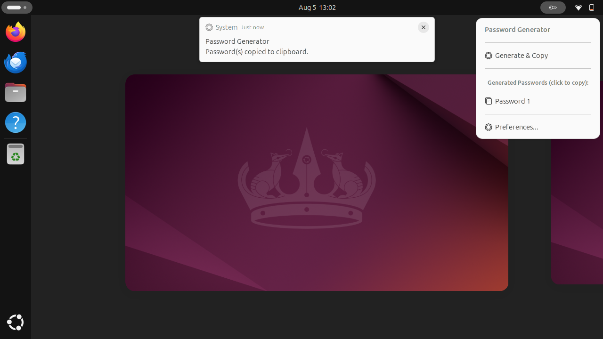
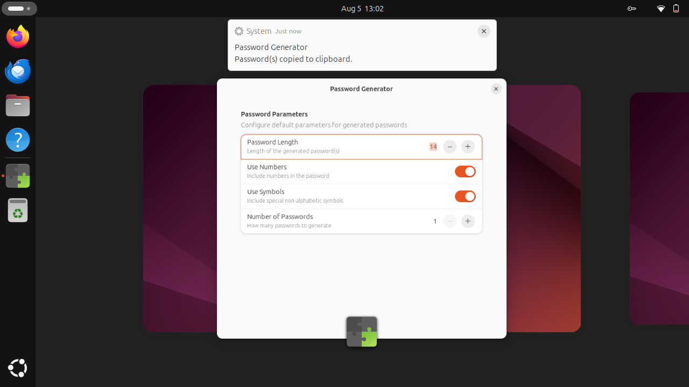

# pwgen — passwords generated inside the extension

[`pwgen`](https://github.com/gortazar/gnome-shell-pwgen) is a GNOME Shell extension that
generates a password and copies it to the clipboard. It used to shell out to the external
`pwgen(1)` binary. It no longer does: passwords are generated in-process, in JavaScript,
from the system entropy pool.

Install it without building anything:

    curl -fsSL https://raw.githubusercontent.com/gortazar/gnome-shell-pwgen/main/install.sh | sh

That downloads the packed extension from the latest
[release](https://github.com/gortazar/gnome-shell-pwgen/releases), checks it against the
SHA-256 published beside it and unpacks it into your extensions directory. Then log out and
back in, and `gnome-extensions enable pwgen-generator@pwgen-gs.patxi`. Everything below is
about developing the extension.

That the passwords are generated in-process matters for two reasons. Spawning an external
program is a rejection risk at
[extensions.gnome.org](https://gjs.guide/extensions/review-guidelines/review-guidelines.html)
whenever an alternative exists, and `pwgen` is not part of any GNOME dependency chain — on a
system without it the extension could only tell the user to install a package. The extension
now has no runtime dependency beyond GNOME Shell itself.

| | |
| --- | --- |
| Menu, after generating |  |
| Preferences |  |

Both images are captures of the real extension running in a real GNOME Shell 46 — see
[Screenshots](#screenshots) below. The generated password is deliberately never shown: the
menu sits in the top panel, visible to anyone looking at the screen or watching a recording,
so items are numbered and the value is only reachable through the clipboard.

## Where the code is

The extension lives in its own repository, **not** in this folder:

    https://github.com/gortazar/gnome-shell-pwgen

`upstream/` is that repository as a git submodule, and it is where every source change is
made. This folder holds the environment, the checks that guard the pinned commit, and the
record of what was done.

    git submodule update --init ideas/pwgen/upstream

The commit is pinned in three places — the submodule gitlink, the `pwgen-src` flake input
(Nix cannot read through a gitlink), and the `**Upstream pin:**` line in `STATUS.md`. All
three are required to agree; see [Bumping the pinned commit](#bumping-the-pinned-commit).

`upstream` is a flake, so this one does not define any checks of its own: it re-exports
upstream's `checks` and `packages.default` at the pinned commit. There is one definition of
what "green" means, and it lives beside the code.

## What changed in the extension

- `lib/generator.js` — a module that imports only `Gio`, so it runs both in the compositor
  and under plain `gjs`. Entropy comes from `crypto.getRandomValues` where the GJS behind the
  running shell provides it, and otherwise from `/dev/urandom` read through the **async** Gio
  API, so no read blocks the main loop. GJS 1.80 (GNOME 46) has no `crypto`, so
  `/dev/urandom` is the path that actually runs today.
- Characters are chosen by rejection sampling. `byte % charset.length` would make the first
  `256 % charset.length` characters of the set more likely than the rest.
- Every enabled character class is guaranteed to appear, placed by a Fisher–Yates shuffle
  over CSPRNG bytes rather than sitting in a fixed prefix.
- There is no weaker fallback: if entropy cannot be read the generator throws and the user is
  told nothing was produced. `Math.random()` and `GLib.Rand` are not used, and a test greps
  the module to keep it that way.
- `extension.js` calls the generator; the subprocess, the `pwgen`-not-installed notification
  and the spawn error handling are gone. The menu UX is unchanged.

The extension's own `GNOME_REVIEW_RULES.md` documents the change against the review
guidelines rule by rule.

## Environment

    cd ideas/pwgen
    nix develop

That is upstream's development shell — `gjs`, `glib-compile-schemas`, Node (for the
extension's own pinned ESLint), Python (for `shexli`), `zip`, `unzip` and a `pwgen-pack`
helper — plus what the scripts here need (`jq`, `curl`, `git`). It deliberately does **not**
provide `gnome-shell`: that closure is about a gigabyte, and the checks that need a real
shell run in the extension's own CI, on six GNOME versions.

## Tests

    nix flake check                        # upstream's own checks, at the pinned commit
    cd upstream && nix run .#tests         # the working tree — what you want while editing

`nix flake check` runs upstream's three checks:

| Check | What it does |
| --- | --- |
| `unit-tests` | The extension's headless suite (`gjs -m tests/run.js`), no display or compositor needed |
| `schemas` | `glib-compile-schemas --strict` over the GSettings schema |
| `pack` | Assembles the upload zip and asserts `lib/generator.js` and the compiled schema are in it |

The suite covers the parts that fail quietly rather than loudly: requested length, only
characters from enabled classes, every enabled class present, a scripted byte source that
would expose modulo bias, distribution over 26 000 draws, guaranteed characters not pinned to
fixed positions, invalid inputs rejected, and a failing entropy source producing no password
at all. Five more cover cancellation — the shell can disable the extension mid-generation, and
what must not happen then is a password arriving into a menu that has been torn down.

The rest are guards on things that broke once and would break silently again: the generator
growing a shell-only import or a subprocess, the CI hook borrowing imports it does not
declare, and `ci/smoke-test.sh` reading the caller's `HOME` or `XDG_RUNTIME_DIR` instead of
building its own (run against a real home it installs over your extensions and rewrites the
live session's extension list).

The installer has a suite of its own. It runs `install.sh` for real against a stub `curl`
serving local fixtures, so a checksum mismatch, a missing asset, an absent `unzip` and a
release with no published checksum are all exercised without touching the network — and
`PREFIX` points at a temporary tree, never at your own extensions directory.

Inside `upstream/`, the extension's own commands are:

    npm ci && npx eslint .   # ESLint over the extension sources
    gjs -m tests/run.js      # the same unit suite, directly
    ./ci/lint-package.sh     # builds the upload package and runs shexli over it
    ./ci/smoke-test.sh       # loads the extension into a throwaway headless shell

## Build and release

    nix build            # -> result/pwgen-generator@pwgen-gs.patxi.shell-extension.zip

Releasing is a tag, not an upload. `.github/workflows/release.yml` in the extension
repository runs the checks, packs that same zip, and publishes it with its `.sha256` as a
GitHub release — which is what the install command at the top of this file downloads.

    # in gortazar/gnome-shell-pwgen, with the version already in metadata.json
    git tag v0.2 && git push origin v0.2
    # or, without pushing a tag:
    gh workflow run Release -f version=v0.2

The workflow refuses to publish when the tag and `metadata.json`'s `version-name` disagree.
Afterwards, from this folder:

    ./scripts/check-release.sh            # the version in STATUS.md
    ./scripts/check-release.sh 0.2        # or a particular one

That downloads the published asset, checks it against the published checksum, and looks
inside the zip for the files the extension needs to load. Nobody watches the run that
publishes a release, so this is what says afterwards that it worked.

Submitting the zip to [extensions.gnome.org](https://extensions.gnome.org/upload/) is a
separate, manual decision and has not been done.

## Screenshots

    ./scripts/screenshot.sh

Both images above were produced by that script, which:

1. installs the extension from `upstream/` into a throwaway `HOME`;
2. appends `scripts/screenshot-hook.js` to the *installed copy* of `extension.js`;
3. boots a nested headless GNOME Shell with its own session bus and a virtual monitor;
4. lets the hook open the menu, generate, capture, then open preferences and capture again.

Your own session is never touched — nothing is installed into it and nothing is enabled in
it. The captures are taken from inside the shell through `Shell.Screenshot`, because the
`org.gnome.Shell.Screenshot` D-Bus interface only answers an allowlist of senders
(gnome-screenshot, the portals) and replies *"Screenshot is not allowed"* to anything else.

Needs `gnome-shell`, `glib-compile-schemas`, `dbus-run-session` and `gdbus` on the system —
i.e. a machine with GNOME, which is why this is not part of `nix flake check`.

## Bumping the pinned commit

After merging something upstream, move all three pins together:

    cd ideas/pwgen
    git submodule update --init upstream          # never run git -C on an empty submodule
    git -C upstream fetch origin && git -C upstream checkout <rev>
    git add upstream
    nix flake lock --refresh --override-input pwgen-src github:gortazar/gnome-shell-pwgen/<rev>
    # and the **Upstream pin:** line in STATUS.md
    ./scripts/check-pin.sh

`scripts/check-pin.sh` compares the submodule gitlink against `flake.lock` *and* against the
commit `STATUS.md` names, failing if any of the three disagree; CI runs it before
`nix flake check`, so a half-done bump cannot pass quietly. Pin a commit that is on `main`,
not one that only exists on a branch — a squash merge with `--delete-branch` orphans the
branch commit and the gitlink then resolves nowhere:

    git -C upstream merge-base --is-ancestor <rev> origin/main

## CI

- **This repository** — `.github/workflows/ci-pwgen.yml` runs `scripts/check-pin.sh` and
  `nix flake check` on any change under `ideas/pwgen/`.
- **The extension repository** — its own workflow runs ESLint, `node --check`, the unit
  suite, `shexli` over the packed zip, a SonarQube Cloud analysis, and a smoke test that
  boots a headless GNOME Shell on Fedora 40–44 plus rawhide (GNOME 46–50) and generates a
  password for real on each. Its `main` is behind a ruleset with no bypass actors: every
  change lands through a pull request with those checks green.
- **Releases** — `release.yml` there, on a `v*` tag or a `workflow_dispatch`; see
  [Build and release](#build-and-release).
